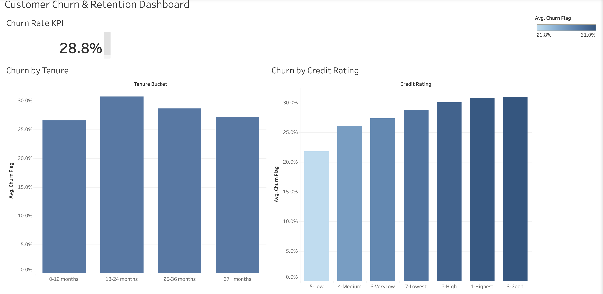

# Customer Churn Analysis — Cell2Cell

Predictive churn and Customer Lifetime Value (CLV) analysis on 51,047 Cell2Cell
customer records, built to answer a single question: **among the highest-value
customers, which ones are most at risk of leaving, and what separates them from
comparable customers who stay?**

Course project for BUS 445 (Customer Analytics) at SFU. Team of 5.

## The approach

The analysis runs in three connected stages:

1. **Churn prediction** — an XGBoost classifier (AUC 0.675) producing a
   per-customer probability of churn.
2. **Customer Lifetime Value** — a CLV score combining retention probability
   with contribution margin, used to isolate the top 30% highest-value customers.
3. **Segmentation and testing** — splitting high-value customers into high- and
   low-retention cohorts at a tuned 65% threshold, then comparing them on usage,
   network quality, and spending using Mann-Whitney U tests.

## Key findings

- The high-value, low-retention segment generates roughly **$488K per month**,
  about 16% of total company revenue, from only 3,956 customers.
- That segment shows significantly worse network experience than comparable
  loyal customers: 61% more dropped-and-blocked calls, 75% more call-waiting
  events, all significant at p < 0.001 (Mann-Whitney U).
- Findings are framed as **association, not causation** — high usage leads to
  more network interactions, which correlates with lower retention.
- The recommended retention and network strategy projects preserving about
  **$3.1M in revenue over three years**.

 ## Interactive Dashboard (Tableau Public)

An interactive dashboard summarizing churn rate, churn by customer tenure, and churn by credit-rating segment.

**Live dashboard:** https://public.tableau.com/app/profile/matin.meraj/viz/CustomerChurnRetentionDashboard_17900448360610/Dashboard1

Built in Tableau Public from the cleaned Cell2Cell dataset (50,891 customers). Key findings: overall churn rate of 28.8%, churn rising with tenure, and higher churn concentrated in lower credit-rating segments.

## What I owned

I contributed the problem-framing and analytical sections: shaping the CLV-anchored
question, the modeling approach, and the statistical comparison between segments.
The final memo and recommendations were produced and reviewed by the full team.

## Contents

- `BUS445_M2_Team5_Cell2Cell.pdf` — the final analytical memo.

## Note

Analysis uses the public Cell2Cell teaching dataset. AI tools were used to help
debug code and refine grammar; the approach, analysis, and recommendations were
produced and reviewed by the team.
